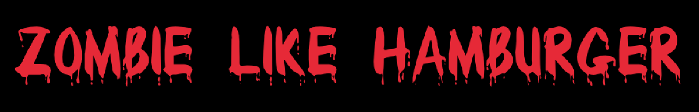

# Zombie Like Hamburger

This is a game written in [Odin](https://odin-lang.org/) for the [Odin Holiday Jam](https://itch.io/jam/odin-holiday-jam).

## Playing the game

https://duffn.itch.io/zombie-like-hamburger

## Notes

At the time of this writing, I'm still new to game development and this is my very first time writing any Odin. While this game builds on macOS and for web, use the repository as reference with a grain of salt.

## Attributions

- Cow sound effect - https://opengameart.org/content/yak-imitation
- Music - https://opengameart.org/content/metal-song-energetic
- Death sound effect - https://opengameart.org/content/hurt-death-sound-effect-for-character
- Zombie font - https://www.1001freefonts.com/bloody.font
- Menu font - https://www.1001freefonts.com/geo-sans-light.font
- Cars and road - https://biscuitlocker.itch.io/2d-cars-and-road
- WASM - https://github.com/byTimo/vscode-odin-raylib-web-desktop/ and https://github.com/Aronicu/Raylib-WASM
